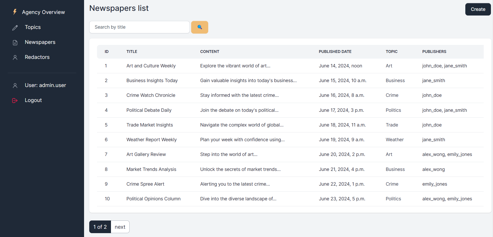
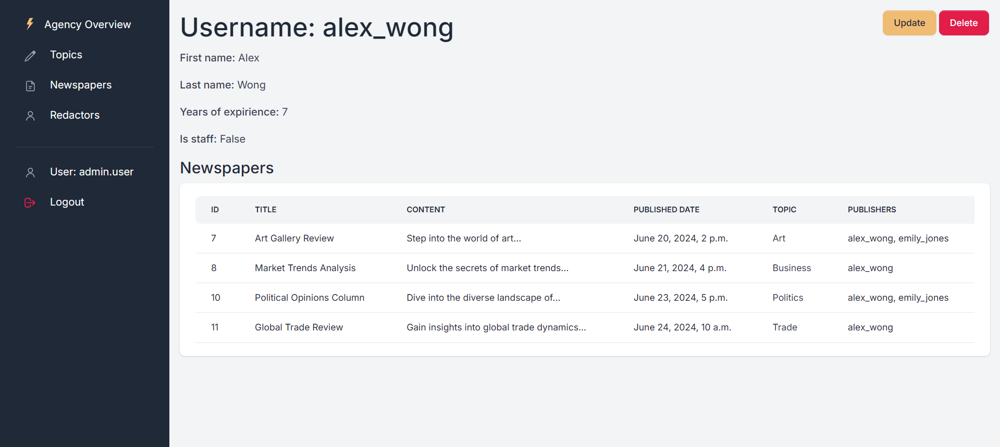

# Newspaper Agency Project

Django project for managing newspapers and redactors in nespaper agency.

## Installation

```
git clone https://github.com/haldaniko/NewspaperAgency-DjangoWebsite.git
cd NewspaperAgency-DjangoWebsite

# on macOS
python3 -m venv venv
source venv/bin/activate

# on Windows
python -m venv venv
venv\Scripts\activate

pip install -r requirements.txt

(create your .env file like .env.sample)

python manage.py migrate
python manage.py loaddata newspapers_db_data.json
python manage.py runserver
```

Application will be available at http://127.0.0.1:8000


After loading data from fixture you can use following superuser (or create another one by yourself):
  - Login: `admin.user`
  - Password: `1qazcde3`


## Features

* Authentication functionality for Redactor/User
* Managing newspapers & topics directly from website interface
* Powerful admin panel for advanced managing

## Demo


